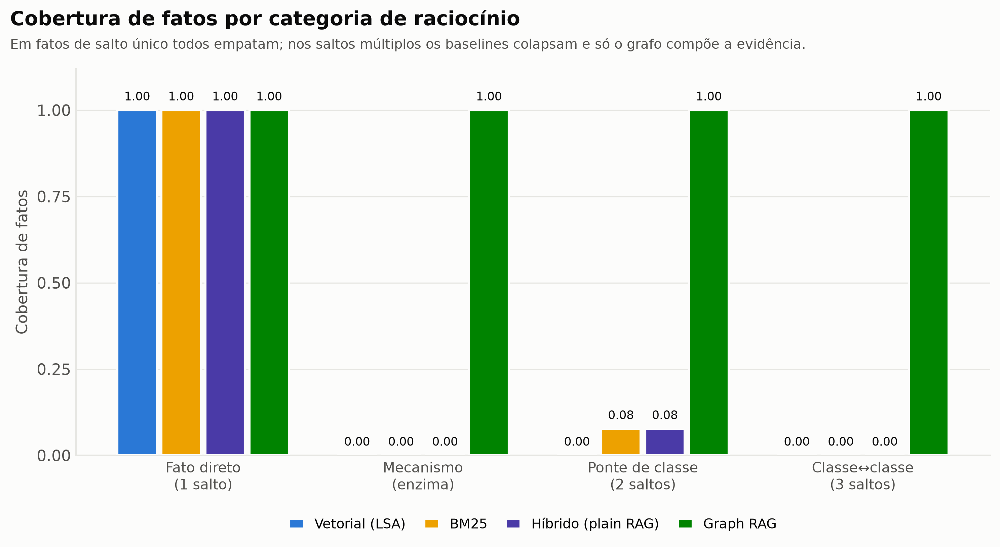
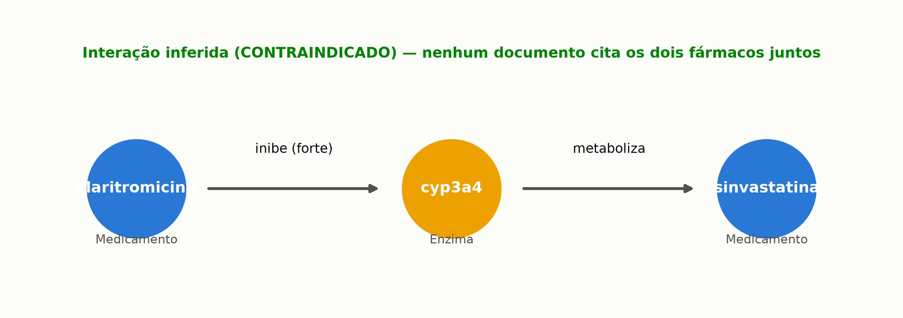
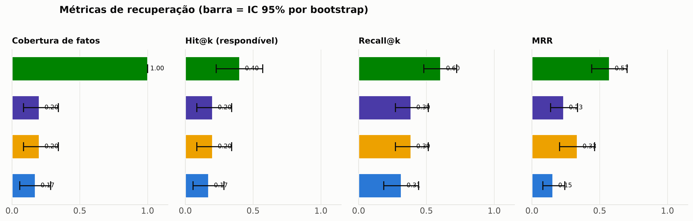
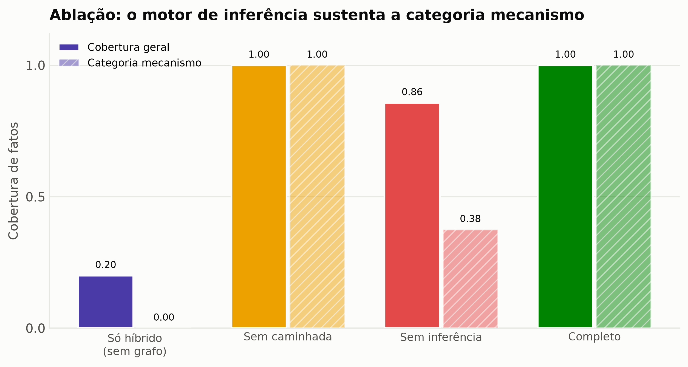
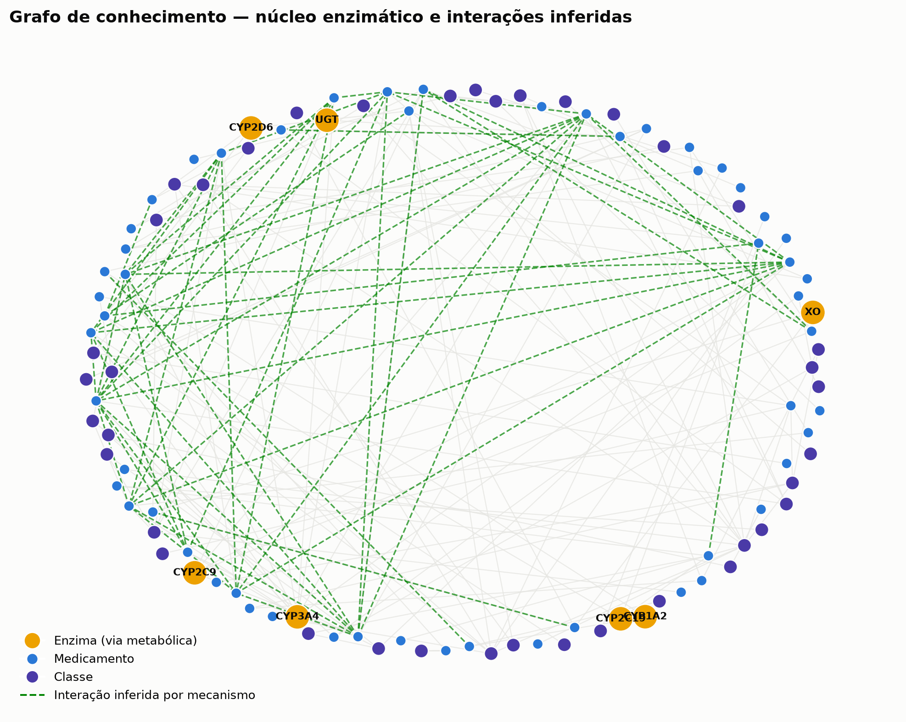

<h1 align="center">⚕️ HYGIA</h1>
<p align="center"><b>Graph RAG para segurança medicamentosa</b><br>
Raciocínio multi-hop <i>auditável</i> sobre interações entre medicamentos</p>

<p align="center">
  
  
  
  
  
</p>

---

## TL;DR

Um verificador de interações medicamentosas que **raciocina sobre um grafo de
conhecimento farmacológico** em vez de apenas recuperar trechos de bula por
similaridade. Resultado central, com significância estatística:

| Categoria de pergunta | Plain RAG (melhor baseline) | **Graph RAG** |
|---|:---:|:---:|
| Fato direto (1 salto) | 1.00 | 1.00 |
| Interação por mecanismo enzimático | 0.00 | **1.00** |
| Ponte de classe (2 saltos) | 0.08 | **1.00** |
| Interação classe↔classe (3 saltos) | 0.00 | **1.00** |
| **Cobertura de fatos (geral)** | **0.20** | **1.00** — Δ +0.80, _p_ = 0.0002 |

O baseline empata em fatos de salto único (o corpus não esconde informação) e
**colapsa** quando a resposta exige compor fatos dispersos em documentos
diferentes. O Graph RAG chega lá por construção — e devolve o **caminho de
raciocínio**, o que torna cada resposta auditável.

<p align="center">
  
</p>

---

## 1. Introdução — o problema

Interações medicamentosas são uma causa evitável e frequente de dano ao
paciente. O desafio de recuperação é sutil e é **exatamente onde o RAG
tradicional quebra**:

> A bula da **varfarina** avisa que ela interage com **anti-inflamatórios não
> esteroidais**. A bula do **ibuprofeno** não menciona a varfarina. A palavra
> "ibuprofeno" e a palavra "varfarina" **nunca aparecem no mesmo documento**.

Um recuperador por similaridade (denso ou BM25) precisa de um trecho que
contenha os dois fármacos para trazê-lo ao topo. Esse trecho não existe.
Responder exige **dois saltos**: `varfarina → classe AINE → ibuprofeno`.

Pior ainda são as interações **mecanísticas**: a claritromicina inibe a enzima
CYP3A4; a sinvastatina é metabolizada pela CYP3A4. Nenhuma bula cita a outra —
a interação (contraindicada, risco de rabdomiólise) **não está escrita em lugar
nenhum**. Ela precisa ser *derivada*.

**Hipótese.** Representar bulas como um grafo de entidades (medicamento, classe,
enzima) e relações, e recuperar percorrendo esse grafo, deve superar o RAG por
similaridade **especificamente nas perguntas multi-hop**, sem perda nas de salto
único — e produzir respostas explicáveis.

**Stakeholders.** Farmacêuticos clínicos e prescritores (usuários), pacientes
(beneficiários), e a área de qualidade/segurança do paciente. Este repositório é
um **protótipo de pesquisa**, não um produto clínico.

📄 Detalhamento em [`docs/PROPOSTA.md`](docs/PROPOSTA.md).

---

## 2. Dados

- **Base curada**: 52 medicamentos de uso corrente no Brasil, 7 vias
  enzimáticas, 45 interações e 4 regras de inferência mecanística.
- **Corpus documental sintético**: 391 chunks / 101 documentos (bulas +
  monografias de classe + monografias de enzima), gerado por template.
- **Documentação assimétrica intencional**: cada interação é descrita na bula de
  **apenas um** dos fármacos — é o que cria a necessidade de multi-hop.
- **Corpus completo**: todo fato necessário está escrito; o desafio é *compor*,
  não *encontrar informação faltante*. Os baselines recebem o mesmo corpus.

📄 Origem, licença, SHA256, vieses e limitações em
[`data/DATA_CARD.md`](data/DATA_CARD.md).

---

## 3. Metodologia — os 7 passos do Graph RAG

<p align="center"></p>

| # | Passo | Módulo | O que faz |
|---|-------|--------|-----------|
| 1 | **Ontologia** | `schema.py` | Tipos de entidade/relação declarativos + validação de esquema |
| 2 | **Extração** | `extract.py` | Texto → triplas (gazetteer determinístico **ou** Claude). Medida contra a semente: **F1 = 1.0** |
| 3 | **Grafo + inferência** | `graph.py` | `networkx` + motor de regras R1–R4 que **deriva** interações mecanísticas |
| 4 | **Indexação** | `index.py` | LSA (denso) + BM25 (léxico), autocontidos |
| 5 | **Recuperação híbrida** | `retriever.py` | Vetor + BM25 + caminhada no grafo, fundidos por Reciprocal Rank Fusion |
| 6 | **Geração** | `answer.py` | Claude redige a resposta com o subgrafo estruturado; modo offline determinístico para o CI |
| 7 | **Avaliação** | `eval.py` | Métricas por categoria, IC 95% por bootstrap, teste de significância pareado, ablação |

**Baselines** (mesma interface, mesmo corpus): vetorial puro, BM25 puro e
**híbrido "plain RAG"** (vetor + BM25 por RRF — o baseline forte a vencer).

📄 Metodologia completa, formalização das regras e escolhas de projeto em
[`docs/METODOLOGIA.md`](docs/METODOLOGIA.md).

---

## 4. Resultados

<p align="center"></p>

- **Cobertura de fatos**: Graph RAG **1.00** vs. melhor baseline **0.20**
  (Δ +0.80; bootstrap pareado _p_ = 0.0002).
- **Recall@8**: 0.605 vs. 0.386 — a caminhada no grafo também traz mais
  chunks-gabarito (ex.: a monografia da classe do *outro* fármaco).
- **MRR**: 0.571 vs. 0.334.

### Ablação — de onde vem o ganho

<p align="center"></p>

Remover o **motor de inferência** derruba a categoria _mecanismo_ de 1.00 para
0.38 — isolando que a derivação mecanística é indispensável ali. A análise
estruturada de pares carrega a cobertura; a caminhada no grafo eleva o recall
textual. Ganho decomposto, não mágico.

### Análise de erros e limitações

- O baseline BM25 acerta 8% das pontes de classe — casos em que o nome do
  fármaco-membro por acaso aparece na monografia recuperada; é ruído, não
  raciocínio (ver `docs/METODOLOGIA.md §6`).
- O grafo pode gerar **falsos positivos mecanísticos** se uma inibição fraca for
  tratada como relevante — mitigado exigindo intensidade forte/moderada (R1) e
  indução forte (R2).
- Cobertura limitada a 52 fármacos; **ausência de interação ≠ segurança**.

📊 Resultados brutos versionados em [`resultados/`](resultados/).

---

## 5. Interface

<p align="center"></p>

App Streamlit com três abas:

1. **Verificador** — informe 2+ medicamentos (por princípio ativo **ou marca**,
   ex.: "Marevan"); veja gravidade, mecanismo, conduta e o **caminho de
   raciocínio no grafo**, com comparação lado a lado Graph RAG × plain RAG.
2. **Explorar o grafo** — subgrafo interativo (`pyvis`) em torno de um fármaco.
3. **Benchmark** — os resultados da avaliação.

```bash
make app     # http://localhost:8501
```

Roda **sem chave de API** (gerador offline determinístico). Com
`ANTHROPIC_API_KEY` definida, a resposta textual é redigida por **Claude Opus 4.8**.

---

## 6. Reprodutibilidade

Ambiente isolado com [`uv`](https://github.com/astral-sh/uv), dependências
pinadas, seeds fixas, artefatos versionados e smoke-test em CI.

```bash
# 1. ambiente
make setup            # cria .venv e instala requirements.txt pinado

# 2. pipeline completo (determinístico): semente -> resultados + figuras
make pipeline

# 3. testes (o mesmo smoke-test que roda no CI)
make test

# 4. interface
make app
```

Sem `make`:

```bash
uv venv .venv --python 3.12 && uv pip install -p .venv/bin/python -r requirements.txt
PYTHONPATH=src .venv/bin/python scripts/pipeline.py
PYTHONPATH=src .venv/bin/python -m pytest tests/ -q
```

- **Determinismo**: toda aleatoriedade deriva de `hygia.config.SEED`; o índice é
  reconstruído bit a bit e há teste que o verifica.
- **CI** ([`.github/workflows/ci.yml`](.github/workflows/ci.yml)): instala o
  ambiente pinado, roda o pipeline em modo rápido e a suíte de testes a cada push.
- **Extração via LLM opcional**: `python scripts/pipeline.py --extrator llm`
  (requer `ANTHROPIC_API_KEY`).

---

## 7. Estrutura

```
hygia-graphrag/
├── data/
│   ├── seed/            # base curada (medicamentos.json, interacoes.json)
│   ├── corpus/          # corpus documental gerado
│   ├── processed/       # grafo, triplas, índice (artefatos)
│   ├── gold/            # conjunto de avaliação
│   └── DATA_CARD.md
├── src/hygia/
│   ├── schema.py        # [1] ontologia
│   ├── corpus.py        # [0] geração do corpus
│   ├── extract.py       # [2] extração de triplas
│   ├── graph.py         # [3] grafo + motor de inferência
│   ├── index.py         # [4] índice vetorial + BM25
│   ├── retriever.py     # [5] recuperadores (baselines + Graph RAG)
│   ├── answer.py        # [6] geração de resposta
│   ├── gold.py          # conjunto de avaliação
│   ├── eval.py          # [7] avaliação + estatística
│   ├── ablation.py      #     estudo de ablação
│   └── resolver.py      #     linguagem -> grafo
├── app/streamlit_app.py # interface
├── scripts/             # pipeline.py, figuras.py
├── tests/               # 15 testes de contrato/regressão
├── docs/                # PROPOSTA.md, METODOLOGIA.md, img/
├── resultados/          # métricas versionadas
├── Makefile · pyproject.toml · requirements.txt
└── .github/workflows/ci.yml
```

---

## Conclusão

O experimento sustenta a hipótese: **representar conhecimento farmacológico como
grafo e recuperar por caminhada supera o RAG por similaridade nas perguntas que
exigem compor fatos dispersos** — de 0.20 para 1.00 de cobertura, com
significância estatística — **sem custo** nas perguntas de salto único, e com a
vantagem decisiva de produzir respostas **explicáveis**: cada interação vem
acompanhada do caminho `A → enzima/classe → B` que a justifica. Em um domínio de
apoio à decisão clínica, essa auditabilidade não é um detalhe — é requisito.

---

> ⚕️ **Aviso.** Protótipo educacional e de pesquisa. Não é dispositivo médico,
> não foi validado clinicamente e não deve orientar prescrição. A conduta é
> sempre do profissional de saúde responsável.

<p align="center"><sub>Projeto de portfólio · Emanuel Abreu · Graph RAG aplicado</sub></p>
